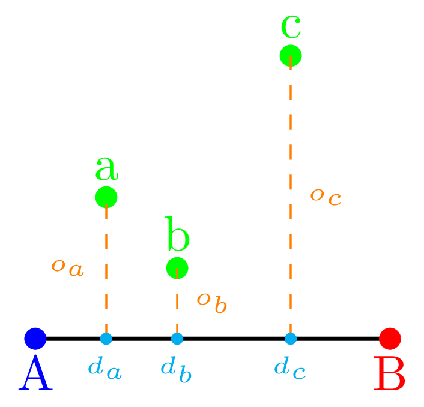

<h1>Offsetor</h1>

This is a plug-in for QGIS 3.x to compute points from given offsets off a baseline. In surveying (e.g., archaeology) one may only have the actual coordinates for two points that form a baseline, and has taken measurements using a tape measure. There are two methods to do this: <i>trilateration</i> or the <i>offset method</i>. For this, one lays out one tape measure along the base line; with a second tape measure the distance from the base line to the point of interest is taken (baseline and tape measure forming a right angle). The surveyor then records the distance along the baseline ($d_{x}$ in the below image), and the offset distance ($o_{x}$) from the baseline to point x.

<h2>Algorithm

The method is rather straight forward to implement:
<ol>
   <li>Find the points $d_{x}$ on the baseline. To do this we do the following:
      <ol>
         <li>The baseline is formed by two vectors A and B; normalize the vector A-B (a vector X is normalized by dividing its components by the magnitude of X);</li>
         <li>with the given distance $d_{i}$ from the start point of the baseline: $A - (N \times d_{i})$, with $N$ being the normalized vector from the previous step.</li>
      </ol>
   <li>Find the vector orthogonal (i.e., at a right angle) to the baseline. This can be done by a 90° rotation, which for a vector P(x,y) is simply P'(-y,x).</li>
   <li>Normalize the orthogonal vector.</li>
   <li>Find the offset point by $NO \times o_{i}$, with $NO$ being the normalized orthogonal vector, and $o_{i}$ the offset from the baseline measured in the survey.</li>
</ol>