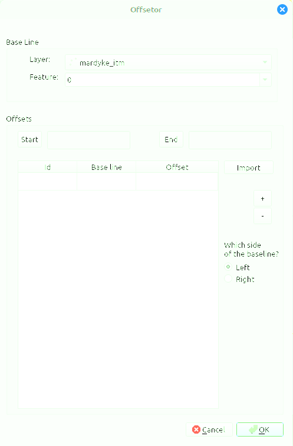

<h1>Offsetor</h1>

This is a plug-in for QGIS 3.x to compute points from given offsets off a baseline. In surveying (e.g., archaeology) one may only have the actual coordinates for two points that form a baseline, and has taken measurements using a tape measure. There are two methods to do this: <i>trilateration</i> or the <i>offset method</i>. For this, one lays out one tape measure along the base line; with a second tape measure the distance from the base line to the point of interest is taken (baseline and tape measure forming a right angle). The surveyor then records the distance along the baseline ($d_{x}$ in the below image), and the offset distance ($o_{x}$) from the baseline to point x.

<h2>Algorithm</h2>
The method is rather straight forward to implement:
<ol>
   <li>Find the points $P_{i}$ on the baseline. To do this we do the following:
      <ol>
         <li>The baseline is formed by two vectors A and B; normalize the vector A-B (a vector X is normalized by dividing its components by the magnitude of X);</li>
         <li>with the given distance $d_{i}$ from the start point of the baseline: $A - (N \times d_{i})$, with $N$ being the normalized vector from the previous step.</li>
      </ol>
   <li>Find the vector orthogonal (i.e., at a right angle) to the baseline. This can be done by a 90° rotation, which for a vector P(x,y) is simply P'(-y,x).</li>
   <li>Normalize the orthogonal vector.</li>
   <li>Find the offset point $x$ by $x = P_{i} - (NO \times o_{i})$, with $P_{i}$ the points on the baseline computed in the first step, $NO$ being the normalized orthogonal vector, and $o_{i}$ the offset from the baseline measured in the survey.</li>
</ol>

<h2>Usage</h2>

The use is quite straight-forward as well (I hope). Upon launching the plug-in, a GUI window will pop up:

Under &lquot;Layer&rquot; you have to select the layer from which you select the points forming the base layer. The dropdown box should only show projected points layers. In the dropdown menu below, &lquot;Feature&rquot;, you select a point from the layer, by the id of the point. Once selected, you have to press either the &lquot;Start&rquot; or the &lquot;End&rquot; buttons to select start point and end point, respectively, of the baseline. The same point cannot be used for both start point and end point. The order does not matter per se, but keep in mind that the offset position is computed from the start point.

Below is then a table with the survey values; the colum <i>Id</i> is an identifier that you can assign yourself, the colum <i>Base line</i> is the distance marker on the baseline in metres (the $d_{i}$ in the above algorithm), the colum <i>Offset</i> holds the offset value $o_{i}$ from the baseline at $d_{i}$. If you want to enter these values manually, simply click into the cell and enter them; the &lquot;+&rquot; and  &lquot;-&rquot; buttons on the right allow you to add or remove lines from the table. The button &lquot;Import&rquot; allows you to import the values from a CSV file. The file should contain only the three columns in the same order as in the table, with no colum header.

Finally, the radio buttons for &lquot;Left&rquot; and &lquot;Right&rquot; specifies which side of the baseline the offsets lie. The sides are determined by &lquot;looking&rquot; from the start point in the direction of the end point.

Please note that this plug-in is still being tested, and likely contains bugs. Patience (and feedback) is appreciated. The software is provided &lquot;as is&rquot; and released under Apache 2.0 license.
